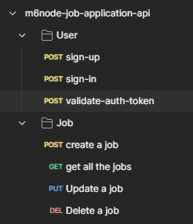

# Job Posting API


## Objectives
Created a JOB Posting API with following CRUD operations:
1. Create a Job
2. Gets all the Jobs
3. Update Job
4. Delete Job

## How to install and run in yours local machine
```bash
npm install
npm run start
```

## Tech. Stack Used:
+ [MongoDB](https://www.mongodb.com/) 
+ [ExpressJS](https://expressjs.com/) 
+ [ReactJS](https://react.dev/) 
+ [NodeJS](https://nodejs.org/en/) 

## Key features:
+ MVC Framework was used to built the application
+ MongoDB as backend Database 
+ ExpressJS for Server Implementation
+ NodeJS for BackEnd
+ ReactJS for FrontEnd

## .env file
```javascript
USER_SESSION_EXPIRES_AFTER="2 days"
PORT=4000
PRIVATE_KEY= Create your own private key any random plain text will work, used for hashing passwords
MONGODB_CONNECTION_STRING= get it from Yours MongoDB Atlas account (https://cloud.mongodb.com/)
```
### Note: 
in this project i have created a database named ```m6node-job-posting-project``` and specify it in 
the MongoDB Connection string inside .env 
```javascript
<abcStringGenertedByMongoDB>mongodb.net/m6node-job-posting-project?retryWrites=true<xyzStringGenertedByMongoDB>
```


USER_SESSION_EXPIRES_AFTER can have following valid values
'2 days'  // 172800000
'1d'      // 86400000
'10h'     // 36000000
'2.5 hrs' // 9000000
'2h'      // 7200000
'1m'      // 60000
'5s'      // 5000
'1y'      // 31557600000

/**
 * 
 * Job ROUTES
 * 
 * 1. Create a Job
 *    POST api/v1/job/create-job
 *    REQUEST:
 *      {
 *         jobTitle : {type: String, required: true},
 *         companyName : {type: String, required: true},
 *         role : {type: String, required: true},
 *         location : {type: String, required: true},
 *         jobDescription : {type: String, required: true},
 *         ctc : {type: Number, required: true},
 *         keywords : {type: String, required: true},
 *         currency : {type: Number, required: true},
 *      }
 *    RESPONSE:
 *     {
 *      'success' : true  
 *      'jobID'  : String unique job id
 *     }
 *     {
 *      'success' : false 
 *      'message' : failure message message
 *     }
 * 
 * 2. Gets all the Jobs
 *    GET api/v1/job/get-jobs
 *    RESPONSE:
 *    it will return array of all the job objects
 * 
 * 3. Update Jobs
 *    PUT api/v1/job/update-job
 *    REQUEST: 
 *      {
 *        jobID : String
 *      }
 *    RESPONSE:
 *      {
 *       'success' : true | false 
 *        'message' : String success message or error 
 *      }
 * 
 * 4. Delete Job
 *  a. what would be the request method and api end point?
 *    DELETE api/v1/job/delete-job 
 *    REQUEST: 
 *      {
 *        jobID : String
 *      }
 *    RESPONSE:
 *      {
 *       'success' : true | false 
 *       'message' : String success message or error 
 *      }
 * 
 */

 /**
 * ROUTES for User
 * POST /api/v1/user/sign-up
 * takes data using html form from user
 * {
 * email: String email address of user
 * password: String Hashed password for sign-in
 * firstName : String first name of user
 * lastName : String last name of user
 * }
 * 
 * POST /api/v1/user/sign-in
 * validate user by taking email and password 
 * {
 * email: String email address of user
 * password: String Hashed password for sign-in
 * }
 * 
 * 
 * POST /api/v1/user/validate-auth-token
 * headers { auth-token : the auth token}
 * 
 */
 


## Author
[Abhishek kumar](https://www.linkedin.com/in/alex21c/), ([Geekster](https://geekster.in/) MERN Stack FS-14 Batch)


